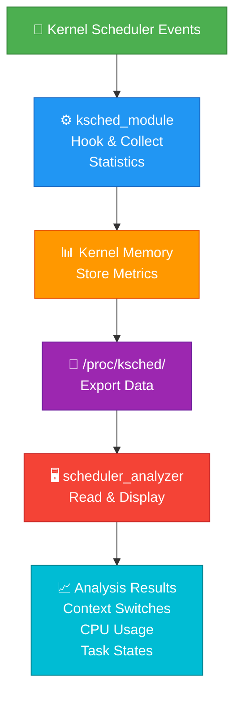

# Kernel Scheduler Statistics Analyzer

A Linux kernel module that collects and analyzes real-time scheduler statistics including CPU utilization, context switches, and task states. This project provides insights into kernel scheduler behavior through procfs interfaces and user-space analysis tools.

## The Module Currently Provides

• **Real-time scheduler statistics collection** - Captures CPU scheduling data and performance metrics
• **Context switch tracking** - Monitors context switches between tasks
• **Per-CPU utilization analysis** - Tracks CPU usage patterns
• **procfs interface** - Exports scheduler data for user-space tools
• **Thread performance monitoring** - Analyzes individual thread scheduling behavior

## Topology / Data Flow



## Processing Flow

1. Kernel hooks capture scheduler events
2. Module collects statistics (context switches, CPU usage, task states)
3. Data stored in kernel memory
4. procfs exports data for user-space access
5. User analyzer reads and displays formatted results

## Repository Files

- `kernel/ksched_module.c` - Kernel module with scheduler hooks and data collection
- `user/scheduler_analyzer.c` - User-space program to display scheduler statistics
- `test/thread_test.c` - Benchmark tests for scheduler analysis
- `include/ksched.h` - Shared header definitions
- `Makefile` - Build configuration
- `.gitignore` - Git ignore rules

## Requirements

Run this project on Linux. The module requires:

- A running Linux kernel with matching kernel headers
- `make` and a C compiler (gcc or clang)
- Root privileges or `sudo` access for module loading
- Kernel support for loadable modules, Netfilter/Kprobes hooks, and procfs
- For user-space tool: standard C libraries

## Build and Run

### 1. Build the module and tools

```bash
make
```

### 2. Load the kernel module

```bash
sudo insmod kernel/ksched_module.ko
```

### 3. Run the scheduler analyzer

```bash
./scheduler_analyzer
```

### 4. View statistics

```bash
cat /proc/ksched/stats
```

### 5. Unload the module

```bash
sudo rmmod ksched_module
```

## About

This project explores Linux kernel scheduling internals through direct kernel instrumentation. It demonstrates kernel module development, Kprobes hooks, procfs interfaces, and real-time statistics collection. Useful for kernel developers and system administrators interested in understanding scheduler behavior.

## Future Enhancements

- Real-time graph plotting of metrics
- Historical data logging
- Per-process CPU affinity tracking
- Integration with Linux tracing tools (ftrace, perf)
- Remote monitoring via network interface

## Related Topics

[kernel-module](https://github.com/topics/kernel-module) • [linux-kernel](https://github.com/topics/linux-kernel) • [scheduler](https://github.com/topics/scheduler) • [statistics](https://github.com/topics/statistics) • [procfs](https://github.com/topics/procfs) • [performance-monitoring](https://github.com/topics/performance-monitoring)
